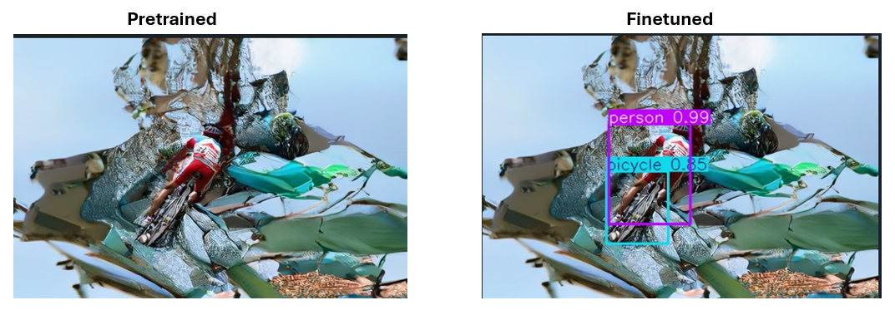
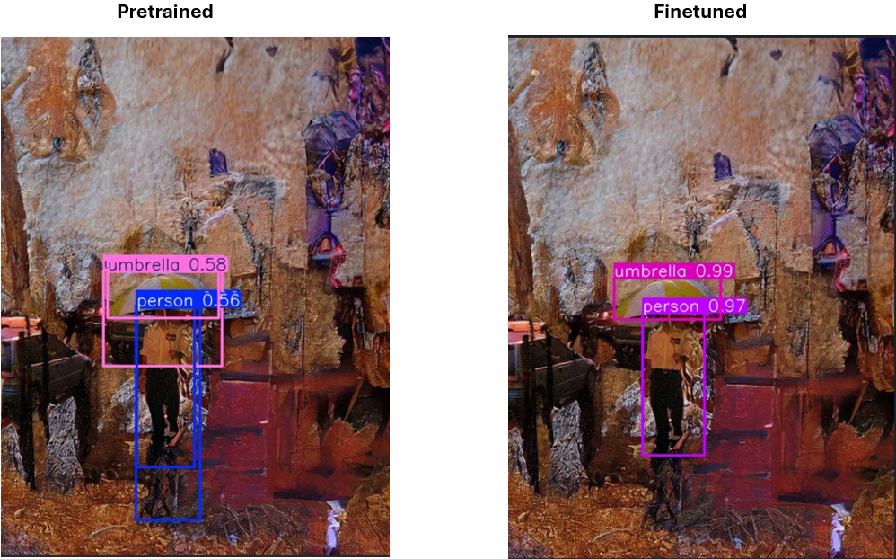

## Final project

### overview
The teacher want us to find an proposed model (from papers like CVPR, etc) and students need make use such model to strech to other question solving.

My team have read [LAKE-RED](/content/results_obstacle/001903_jpg/results2.jpg) (from 2024 CVPR accepted paper), and we want to try that **does an object detection model detect generative image successfully?**

### Experiment conduct
1. Segformer  (Failure)  
I choose this model at first because I don't want to try `YOLO-series`.  
It was a terrible experience..  
I don't know how but segformer is hard to train (due to transfomer?)  
As the result, my trained segformer are good at predict background not focus on `background`.

2. EfficientDet (Failure)  
I look up for a newer type of detection model.  
I found `EfficientDet` may be suitable.  
The reason why I fail is because that I encountered `CUDA out of memory` Error in Colab.  
I have no idea how to figure it out, and when I try at lower epoch, it detect nothing.  
As the reason you seen above, I give up this model.

3. YOLO11-detect (Success)  
My teammate use `YOLO11-seg`, so I decided to use `YOLO11-detect` to compare with it.  
    * First, I tried the pretrained model `YOLO11n.pt` to judgify the detection performance on pure-data from [Obstacle-dataset](https://github.com/TW0521/Obstacle-Dataset).  
    I found that YOLO11-detect have good detections.
    * Second, I tried on generated image, but it seems that YOLO11 was affected by the background, so it may detect nothing.
    * Third, create a dataset to finetuning on such generative image.  
    We hope to improve object detection model's robustness.  
    To compared with `YOLO11-seg`, I used the same dataset that trained on YOLO11-seg.  
    In the dataset, some data augmentation are generated by `roboflow`.
    e.g:
        * Auto-oritentation
        * Resize to 640x640
        * Flip with 50%
        * 90-degree Rotate Augmentation
        * Rotation Augmentation from -15-degree to 15-degree
        * Brightness Augmentation from -15 to 15
        * Blur Augmentation
    * Compared            
    I don't know such comparison is reasonable, I tried to interpret their work.
        * 基於預測框的準確率: $\frac{預測正確的預測框}{全部圖片的預測框}$
        * 基於 Ground truth 的準確率: $\frac{預測完全跟 ground \ truth 一致}{全部圖片}$

| 模型類型        | 基於預測框的準確率           | 基於 Ground truth 的準確率  |
| ------------- |:-------------:| -----:|
| **YOLO11 detect Finetuned model**      | **0.8936** | **0.8462** |
| **YOLO11 seg Finetuned model**      | **0.8807** | **0.8765** |
| **YOLO11 detect Pretrained model**      | 0.7533      |   0.5267 |
| **YOLO11 seg Pretrained model**      | 0.8683      |   0.8313 |

After YOLO11-detect finetuning, it actually improve the detection robustness.  
e.g 
Also, the result are more reliable.  

**Conclusion: using LAKE-RED (generative model) to create new image data, such type of data augmentation may actually improve object detection model's robustness.**